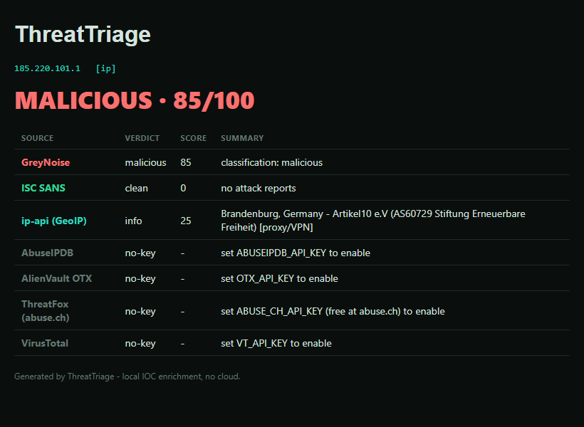

# 🛂 ThreatTriage

Automated **IOC enrichment and alert triage** for SOC analysts. Feed it an IP, file hash, domain, or URL; it enriches the indicator across multiple threat-intel sources in parallel, aggregates a risk score, and renders a verdict - the repetitive first-pass triage a Tier-1 analyst does dozens of times a shift, automated.

Built with the **Python standard library only** - no `pip install`, no dependencies. HTTPS is routed through the OS certificate store, so it works on locked-down corporate machines and behind SSL-inspecting proxies.

```
  ThreatTriage  ::  185.220.101.1  [ip]
  ------------------------------------------------------------
  Verdict:  MALICIOUS    Risk:  85/100  [####################----]
  Flagged by: GreyNoise
  ------------------------------------------------------------
    *  GreyNoise              [ 85] classification: malicious
    *  ISC SANS               [  0] no attack reports
    *  ip-api (GeoIP)         [ 25] Brandenburg, Germany - Artikel10 e.V (AS60729) [proxy/VPN]
    -  AbuseIPDB              set ABUSEIPDB_API_KEY to enable
    -  VirusTotal             set VT_API_KEY to enable
```

It also renders an HTML report (`--html`):



---

## What it does
1. **Classify** the indicator (IP / hash / domain / URL).
2. **Enrich** it across every applicable source, concurrently.
3. **Score** the aggregate risk (highest confident signal, with a bump when sources corroborate).
4. **Report** a verdict - `CLEAN` / `SUSPICIOUS` / `MALICIOUS` - to terminal, JSON, or HTML.

## Sources
| Source | Indicator types | API key |
|--------|-----------------|---------|
| **ip-api** (GeoIP/ASN) | IP | none |
| **ISC SANS** (attack reports) | IP | none |
| **GreyNoise** (internet scanners) | IP | none (community) |
| **AbuseIPDB** (abuse confidence) | IP | free |
| **ThreatFox** (abuse.ch IOC db) | IP, hash, domain, URL | free |
| **VirusTotal** (60+ engines) | IP, hash, domain, URL | free |
| **AlienVault OTX** (threat pulses) | IP, hash, domain, URL | free |

It works out-of-the-box for **IP triage** with no keys. Adding free keys (see `.env.example`) unlocks hash / domain / URL coverage and more corroborating sources.

## Usage
```bash
python -m threattriage 185.220.101.1                 # one indicator
python -m threattriage 8.8.8.8 evil.com <sha256>     # batch
python -m threattriage 1.2.3.4 --json                # JSON (for piping)
python -m threattriage 1.2.3.4 --html report.html    # HTML report
```
Exit code is **2** when any indicator is malicious - handy for scripts and SOAR pipelines:
```bash
python -m threattriage "$ALERT_IP" || echo "escalate!"
```

## How it works
- **Concurrency:** `ThreadPoolExecutor` fans out to all sources at once.
- **Scoring:** each source returns a normalized 0-100 confidence; the aggregate takes the strongest signal and adds a small bump when two or more sources agree.
- **Caching:** responses are cached on disk (TTL) to respect free-tier rate limits.
- **TLS:** an `ssl` context loaded from the OS trust store (with the strict-mode quirk relaxed for non-compliant proxy CAs); a `THREATTRIAGE_INSECURE=1` escape hatch exists for fully broken interceptors.

## Tech
Python 3, standard library only (`urllib`, `ssl`, `concurrent.futures`, `argparse`, `json`). Modular enrichers, normalized results, pluggable scoring.

## Roadmap
- [ ] Bulk mode: triage a file of indicators, output CSV
- [ ] Sysmon/Sentinel alert parsing -> auto-extract and triage IOCs
- [ ] More sources: Shodan, URLScan, MalwareBazaar
- [ ] Local allowlist to suppress known-good infrastructure

*Defensive security tooling. Query indicators you are authorized to investigate.*
